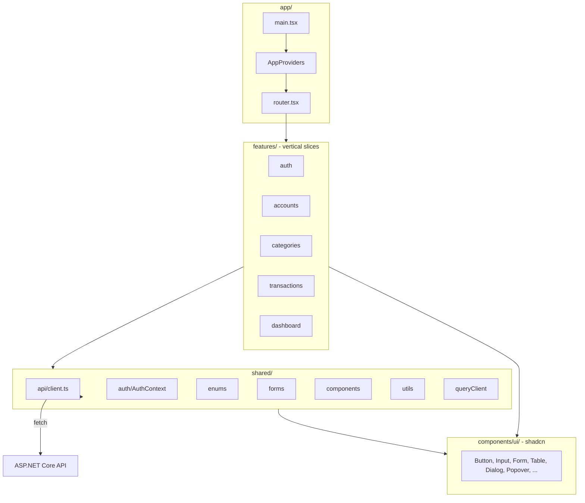
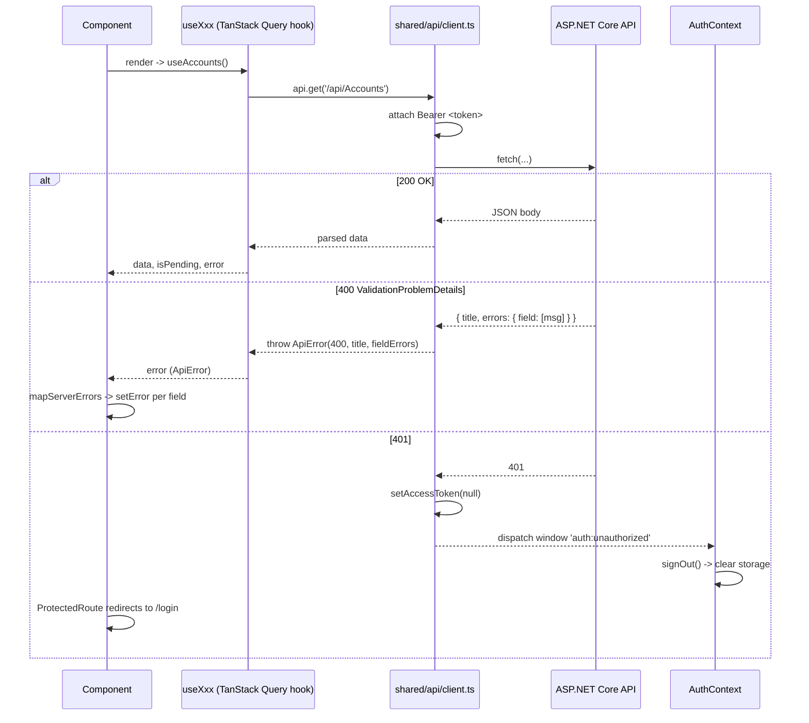

# MyFinanceTracker.Web - Implementation Summary

This doc explains exactly what was built in `MyFinanceTracker.Web/`, how it's wired together, and the small decisions and gotchas that came up while implementing the [SPA plan](web-spa-plan.md). It's intended as a guided tour of the codebase for someone (or future-you) opening the project for the first time.

**New to React?** Start with [web-spa-learning-guide.md](web-spa-learning-guide.md) for a step-by-step reading order through this codebase (.NET analogies, exercises, suggested pace).

## 1. How to run locally

1. Restore Node deps once: `cd MyFinanceTracker.Web && npm install`.
2. Start the API on port 5010 (the `http` launch profile):
   ```bash
   dotnet run --project MyFinanceTracker.Api
   ```
3. In a second terminal, start the SPA:
   ```bash
   cd MyFinanceTracker.Web
   npm run dev
   ```
4. Open <http://localhost:3000>.

The Vite dev server proxies `/api/*` to `http://localhost:5010` (see [`vite.config.ts`](../MyFinanceTracker.Web/vite.config.ts)), so the browser only ever talks to one origin and there's no CORS in development.

### Useful scripts (from `MyFinanceTracker.Web/`)

| Command           | What it does                                              |
| ----------------- | --------------------------------------------------------- |
| `npm run dev`     | Vite dev server on `http://localhost:3000`                |
| `npm run build`   | `tsc -b` typecheck, then Vite production build to `dist/` |
| `npm run preview` | Serve the production `dist/` locally to test it           |
| `npm run lint`    | Run ESLint over the codebase                              |

## 2. What was built (tech stack)

| Concern        | Choice                                                                      |
| -------------- | --------------------------------------------------------------------------- |
| Build / dev    | Vite 8 + React 19 + TypeScript strict (`erasableSyntaxOnly`)                |
| Styling        | Tailwind CSS v4 (via `@tailwindcss/vite`, no PostCSS config)                |
| UI primitives  | shadcn/ui (`radix-nova` style) - sources live in `src/components/ui/`       |
| Icons          | `lucide-react`                                                              |
| Routing        | `react-router` v7 (`createBrowserRouter`, lazy routes)                      |
| Server state   | `@tanstack/react-query` v5 + devtools                                       |
| Forms          | `react-hook-form` + `zod` + `@hookform/resolvers` via shadcn `<Form>`       |
| Auth state     | React Context + custom hook + `localStorage`                                |
| Toasts         | `sonner` (mounted via shadcn's `Toaster`)                                   |
| Dates          | `date-fns` + a shadcn-style `DatePicker` (Popover + Calendar)               |
| Comboboxes     | shadcn `Popover` + `Command` composed into a typed `Combobox`               |
| Lint / format  | ESLint + Prettier + `prettier-plugin-tailwindcss` (auto-sorts Tailwind)     |

## 3. Folder map

```text
MyFinanceTracker.Web/
  index.html                           Vite entry HTML
  vite.config.ts                       Vite + Tailwind plugin + path alias + /api proxy
  tsconfig.json / tsconfig.app.json    Strict TS; @/* -> src/*
  components.json                      shadcn CLI config (style, aliases, base color)
  .env / .env.production               VITE_API_BASE_URL (empty in dev = use proxy)
  .prettierrc.json                     Prettier + tailwind plugin
  eslint.config.js                     ESLint flat config, ignores src/components/ui/**
  README.md                            SPA-local README
  src/
    main.tsx                           Bootstraps <AppProviders/>
    index.css                          Tailwind v4 entry + shadcn theme variables
    app/
      AppProviders.tsx                 Composition root (providers, router, Toaster, devtools)
      router.tsx                       createBrowserRouter, public/protected layouts, lazy pages
    components/ui/                     shadcn-generated components (Button, Input, Form, Table, ...)
    lib/utils.ts                       cn() helper (clsx + tailwind-merge)
    shared/
      api/
        ApiError.ts                    Error class with status + fieldErrors
        problemDetails.ts              ASP.NET Core ValidationProblemDetails type + guard
        client.ts                      fetch wrapper; token injection; 401 event; error parsing
      auth/
        AuthContext.tsx                Provider: session state, signIn/signOut, 401 listener
        useAuth.ts                     Hook: throws if used outside the provider
        ProtectedRoute.tsx             Route guard - redirects to /login with from-state
        tokenStorage.ts                localStorage get/set/clear + isExpired
      enums/
        accountType.ts                 as-const object + AccountTypeLabels/Options
        currencyCode.ts                as-const + CurrencyCodeLabels + ISO codes
        transactionType.ts             as-const + TransactionTypeLabels/Options
      forms/
        DatePicker.tsx                 Popover + Calendar, forwardRef, clearable
        Combobox.tsx                   Popover + Command, generic over TValue
        mapServerErrors.ts             ValidationProblemDetails -> RHF setError (PascalCase -> camelCase)
      components/
        AppLayout.tsx                  Sidebar + topbar + mobile Sheet; sign-out button
        AuthLayout.tsx                 Centered card for login/register
        PageHeader.tsx                 Page title + description + actions
        AsyncBoundary.tsx              Pending/error/empty state wrapper
        ConfirmDialog.tsx              AlertDialog wrapper (destructive optional)
        ThemeToggle.tsx                Toggles `dark` class on <html>, persists in localStorage
      utils/
        money.ts                       Intl.NumberFormat-based currency formatting
        date.ts                        formatDate / formatDateTime / start-end of day UTC
      queryClient.ts                   QueryClient with sane defaults; no retry on 401/404
    features/
      auth/
        api.ts, schemas.ts, types.ts
        pages/{LoginPage,RegisterPage}.tsx
      accounts/
        api.ts, schemas.ts, types.ts
        components/{AccountsTable,AccountFormDialog}.tsx
        pages/AccountsPage.tsx
      categories/
        api.ts, schemas.ts, types.ts
        components/{CategoriesTable,CategoryFormDialog}.tsx
        pages/CategoriesPage.tsx
      transactions/
        api.ts, schemas.ts, types.ts
        useTransactionFilters.ts       URL-search-param-backed filter state
        components/{TransactionsTable,TransactionFormDialog,TransactionFilters}.tsx
        pages/TransactionsPage.tsx
      dashboard/
        pages/DashboardPage.tsx
      errors/
        NotFoundPage.tsx
```

## 4. Architecture



**Dependency rules**:

- `features/*` may depend on `shared/*` and `components/ui/*`.
- `features/*` **never** import from each other (`transactions` is the one place that imports `useAccounts` / `useCategories` from sibling features for combobox data, which is the only allowed cross-feature import - data dependencies for foreign keys).
- `shared/*` **never** imports from `features/*`.
- `app/` is the composition root - it wires the providers and the router.

## 5. End-to-end request flow



## 6. Conventions you'll see everywhere

### 6.1 The vertical slice

Each feature (`accounts`, `categories`, `transactions`, `auth`) follows the same shape:

- **`types.ts`** - TypeScript mirrors of the API DTOs (intentionally hand-written to keep the build simple; can be replaced with OpenAPI codegen later).
- **`schemas.ts`** - Zod schemas for the request bodies, plus inferred form-value types. These play the role of FluentValidation **on the client**; the server is still the source of truth.
- **`api.ts`** - TanStack Query hooks (`useAccounts`, `useCreateAccount`, ...) plus a **key factory** for typed cache invalidation:
  ```ts
  export const accountsKeys = {
    all: ['accounts'] as const,
    lists: () => [...accountsKeys.all, 'list'] as const,
    list: (includeInactive: boolean) =>
      [...accountsKeys.lists(), { includeInactive }] as const,
    details: () => [...accountsKeys.all, 'detail'] as const,
    detail: (id: string) => [...accountsKeys.details(), id] as const,
  };
  ```
- **`components/`** - feature-specific UI (the form dialog, the table).
- **`pages/`** - the route entry; usually composes `PageHeader` + `AsyncBoundary` + the feature components.

### 6.2 Forms

Every form follows the shadcn `<Form>` + RHF + Zod pattern:

```tsx
const form = useForm<FormValues>({
  resolver: zodResolver(schema),
  defaultValues: { ... },
});

<Form {...form}>
  <form onSubmit={form.handleSubmit(onSubmit)} className="space-y-4" noValidate>
    <FormField control={form.control} name="name" render={({ field }) => (
      <FormItem>
        <FormLabel>Name</FormLabel>
        <FormControl><Input {...field} /></FormControl>
        <FormMessage />
      </FormItem>
    )} />
    ...
  </form>
</Form>
```

On submit, mutations call `mapServerErrors(form.setError, error, { knownFields: [...] })`. Any server validation error whose field name matches a known field becomes an inline `<FormMessage>`; the rest fall back to a `root.serverError` rendered as a `<Alert variant="destructive">` at the top of the form.

### 6.3 Numeric enums (TS gotcha)

The API serializes enums as numbers (System.Text.Json default). Combined with `erasableSyntaxOnly: true` in [`tsconfig.app.json`](../MyFinanceTracker.Web/tsconfig.app.json), TS `enum` is forbidden. Pattern:

```ts
export const AccountType = {
  Checking: 0,
  Savings: 1,
  CreditCard: 2,
  Cash: 3,
} as const;
export type AccountType = (typeof AccountType)[keyof typeof AccountType];
```

For Zod narrowing to the exact union type (not just `number`), use `z.union([z.literal(...), ...])`:

```ts
const accountTypeField = z.union(
  [
    z.literal(AccountType.Checking),
    z.literal(AccountType.Savings),
    z.literal(AccountType.CreditCard),
    z.literal(AccountType.Cash),
  ],
  { message: 'Pick an account type' },
);
```

Without that, `z.infer` widens to `number` and won't satisfy `CreateAccountRequest.accountType`.

### 6.4 Auth flow

- Token is stored in `localStorage` (`shared/auth/tokenStorage.ts`).
- On startup, `AuthProvider` hydrates from `localStorage`, drops the token if `expiresAt` has passed, otherwise calls `setAccessToken(token)` to inject it into the API client.
- Login (`features/auth/api.ts::useLogin`) returns `{ accessToken, expiresAt }`; the page calls `signIn(response)` which writes to storage and updates state.
- Register returns a user id (`Result<string>` server-side), so the register page **chains** register -> login -> `signIn` (see [`RegisterPage.tsx`](../MyFinanceTracker.Web/src/features/auth/pages/RegisterPage.tsx)).
- A 401 anywhere dispatches the `auth:unauthorized` event; `AuthProvider` calls `signOut()`; `ProtectedRoute` then redirects to `/login`.

### 6.5 URL-driven filters

The Transactions page uses `useTransactionFilters` ([`useTransactionFilters.ts`](../MyFinanceTracker.Web/src/features/transactions/useTransactionFilters.ts)) to store the filter state in the URL (`useSearchParams`). Benefits:

- Filters survive refresh.
- Filter URLs are shareable.
- Each filter combo is a distinct TanStack Query cache entry (the key is `[..., 'transactions', 'list', { accountId, categoryId, from, to }]`).
- `from`/`to` are converted to start-of-day / end-of-day UTC before being sent to the API.

### 6.6 Cache invalidation

- `useCreateAccount` / `useUpdateAccount` / `useDeleteAccount` invalidate `accountsKeys.lists()` on success (and the specific detail key for update).
- Transaction mutations invalidate both `transactionsKeys.lists()` and `['accounts', 'list']` (so account balances refresh after a transaction).

## 7. Decisions and gotchas worth knowing

- **`localStorage` for the JWT** is the pragmatic choice today (no refresh token in the API yet - see step 7 of [project-plan.md](project-plan.md)). When refresh tokens land, switch to in-memory token + httpOnly refresh cookie.
- **Numeric enums** + Zod: had to use `z.union([z.literal(...)])` instead of `z.number().refine(...)` to get the narrowed type.
- **react-day-picker v10**: shadcn's generated `Calendar` used `table:` (a v9 key that no longer exists) and the `initialFocus` prop is gone. Both are removed; the DatePicker uses `autoFocus` instead.
- **shadcn `form` in `radix-nova` style**: the CLI's `add form` is a no-op in this style. We wrote [`src/components/ui/form.tsx`](../MyFinanceTracker.Web/src/components/ui/form.tsx) by hand following the standard shadcn pattern (with the `radix-ui` umbrella import used by the rest of the generated files).
- **TS `enum` is forbidden** by `erasableSyntaxOnly: true`. Always use `as const` objects.
- **Optional string fields** + Zod + RHF can produce a confusing type mismatch (`description?: string` vs `description: string | undefined`). We sidestepped it in `TransactionFormDialog` by making `description` always a `string` in the form and converting empty to `null` before sending to the API.
- **Cross-feature data dependencies**: `transactions` imports `useAccounts` and `useCategories` (it needs them for foreign-key pickers). This is the only allowed cross-feature import - any other coupling should go through `shared/`.
- **ESLint `react-refresh/only-export-components`** is intentionally suppressed at the top of [`router.tsx`](../MyFinanceTracker.Web/src/app/router.tsx) and [`AuthContext.tsx`](../MyFinanceTracker.Web/src/shared/auth/AuthContext.tsx) because both files have to export non-component values (`router`, `AuthContext`).

## 8. Verification

- `npx tsc -b` clean.
- `npm run build` produces a code-split bundle (per-route lazy chunks, ~106 kB gzipped for the root index).
- `npm run lint` clean.
- `npm run dev` starts on port 3000; `GET /` returns 200, `GET /src/main.tsx` transforms successfully.

## 9. Deploy options

- **Separate origin**: build with `npm run build`, host `dist/` on any static host (Netlify, Vercel, Azure Static Web Apps, S3+CloudFront). Set `VITE_API_BASE_URL` in `.env.production` to the API origin and add that origin to `Cors:AllowedOrigins` in [`MyFinanceTracker.Api/appsettings.json`](../MyFinanceTracker.Api/appsettings.json).
- **Same origin**: copy `dist/` into `MyFinanceTracker.Api/wwwroot`, add `app.UseStaticFiles()` and a SPA fallback (`app.MapFallbackToFile("index.html")`) in [`MyFinanceTracker.Api/Program.cs`](../MyFinanceTracker.Api/Program.cs). No CORS needed.

## 10. Possible follow-ups

- OpenAPI / Swagger client codegen (Orval or openapi-typescript-codegen) to replace hand-written `types.ts` and `api.ts` once DTO churn becomes annoying.
- Refresh-token flow (and migrate token storage out of `localStorage`).
- Per-currency dashboards / charts (Recharts or Visx).
- E2E tests with Playwright (login -> create account -> create transaction -> verify totals).
- Server-side aggregation for the dashboard if the transactions list grows large enough that loading "this month" client-side becomes wasteful.
