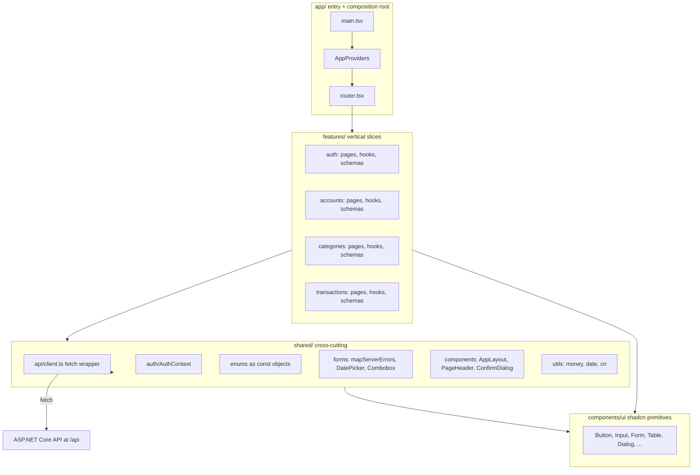

# MyFinanceTracker.Web - React SPA Plan

> **Status:** implemented. See [web-spa-implementation.md](web-spa-implementation.md) for what was actually built and how it differs (if at all) from this plan.

A vertical-slice, feature-based architecture mirroring the API's `Features/Accounts`, `Features/Categories`, `Features/Transactions` layout. We build a full slice (Accounts) first as the canonical pattern, then replicate for Categories and Transactions.

## 1. Tech stack and why

| Concern       | Choice                                                                    | Rationale                                                                            |
| ------------- | ------------------------------------------------------------------------- | ------------------------------------------------------------------------------------ |
| Build tool    | Vite (already scaffolded)                                                 | Fast HMR, modern defaults                                                            |
| Language      | TypeScript strict + `erasableSyntaxOnly`                                  | Already configured; means no TS `enum` - we use `as const` objects                   |
| Styling       | Tailwind CSS v4 (Vite plugin)                                             | Utility-first; the modern React styling default                                      |
| UI components | shadcn/ui (Radix primitives + Tailwind)                                   | You own the component source; accessible by default; small bundle                    |
| Icons         | `lucide-react`                                                            | Ships with shadcn init; tree-shakeable                                               |
| Tables        | `@tanstack/react-table` headless + shadcn `<Table>`                       | Powerful (sort/filter/paginate) without UI lock-in                                   |
| Routing       | `react-router` v7 (data router via `createBrowserRouter`)                 | De facto standard; supports loaders/actions if you grow into them                    |
| Server state  | `@tanstack/react-query` v5                                                | Cache, refetch, optimistic updates, devtools - the right primitive for REST          |
| Forms         | `react-hook-form` + `zod` + `@hookform/resolvers` + shadcn `<Form>`       | shadcn's Form wires RHF + accessibility cleanly                                      |
| Auth state    | React Context + custom hook                                               | Sufficient; no Zustand/Redux needed for this app                                     |
| Dates         | `date-fns` + shadcn DatePicker (Popover + Calendar)                       | `react-day-picker` is bundled with shadcn calendar                                   |
| Toasts        | `sonner` (via shadcn)                                                     | Lightweight, imperative `toast.success(...)`                                         |
| Lint/format   | existing ESLint + add Prettier + `prettier-plugin-tailwindcss`            | Auto-sort Tailwind classes                                                           |

## 2. Architecture (mirrors API's clean architecture mindset)



**Rules**:

- `features/*` depend on `shared/*` and `components/ui/*`; never on each other (a transaction page imports `useAccounts` from `features/accounts/api`, not the other way around).
- `shared/*` never imports from `features/*`.
- `components/ui/*` is generated by the shadcn CLI - you can modify these files freely; they are yours.
- `app/` is the composition root - it wires providers and the router.

## 3. Step-by-step build

### Step 1 - Dependencies, Tailwind v4, shadcn init, Vite config, path alias

**Install runtime deps**:

```bash
npm i react-router @tanstack/react-query @tanstack/react-query-devtools @tanstack/react-table \
      react-hook-form zod @hookform/resolvers \
      date-fns
```

**Install Tailwind v4** (Vite plugin approach - no PostCSS config needed):

```bash
npm i -D tailwindcss @tailwindcss/vite
npm i -D prettier prettier-plugin-tailwindcss eslint-config-prettier
```

Update `MyFinanceTracker.Web/vite.config.ts`:

```ts
import { defineConfig } from 'vite';
import react from '@vitejs/plugin-react';
import tailwindcss from '@tailwindcss/vite';
import path from 'node:path';

export default defineConfig({
  plugins: [react(), tailwindcss()],
  resolve: { alias: { '@': path.resolve(__dirname, 'src') } },
  server: {
    port: 3000,
    proxy: {
      '/api': { target: 'http://localhost:5010', changeOrigin: true },
    },
  },
});
```

Why proxy? In dev the SPA calls relative URLs like `/api/Accounts`. The proxy forwards to the API on port 5010 so there's **no CORS in dev** and **no need for an env var for the API URL**. The existing API CORS for `http://localhost:3000` becomes a fallback only.

Add `paths` to `tsconfig.app.json` and `tsconfig.json` (shadcn CLI requires the alias to be resolvable from both):

```json
"baseUrl": ".",
"paths": { "@/*": ["src/*"] }
```

Replace `src/index.css` with a minimal Tailwind v4 entry (shadcn init will extend this):

```css
@import 'tailwindcss';
```

Create `.env`, `.env.production`:

```
VITE_API_BASE_URL=
VITE_API_BASE_URL=https://api.your-domain.com
```

Empty in dev means "use relative URLs through the Vite proxy".

**Run the shadcn initializer**:

```bash
npx shadcn@latest init
```

When prompted, choose: TypeScript, base color `slate` (or `zinc`), CSS variables yes. This:

- writes `components.json` (shadcn config: alias paths, style, base color),
- adds the CSS variable block + `@theme inline` + dark-mode setup into `src/index.css`,
- installs `class-variance-authority`, `clsx`, `tailwind-merge`, `lucide-react`, `tw-animate-css`,
- creates `src/lib/utils.ts` exporting `cn(...)` (a `clsx` + `tailwind-merge` helper used everywhere).

**Add the components you'll need up front**:

```bash
npx shadcn@latest add button input label textarea select form dialog alert-dialog dropdown-menu \
                       table badge card separator skeleton alert popover calendar command sonner sheet
```

Each command creates a file under `src/components/ui/`. These files are **yours** - committed, editable.

### Step 2 - Folder structure

```
src/
  app/
    AppProviders.tsx
    router.tsx
  components/
    ui/                       (created/managed by shadcn CLI; you can edit)
  lib/
    utils.ts                  (cn() helper from shadcn init)
  shared/
    api/{client.ts, ApiError.ts, problemDetails.ts}
    auth/{AuthContext.tsx, useAuth.ts, tokenStorage.ts, ProtectedRoute.tsx}
    enums/{accountType.ts, currencyCode.ts, transactionType.ts}
    forms/{DatePicker.tsx, Combobox.tsx, mapServerErrors.ts}
    components/{AppLayout.tsx, AuthLayout.tsx, PageHeader.tsx, ConfirmDialog.tsx, AsyncBoundary.tsx}
    utils/{money.ts, date.ts}
    queryClient.ts
  features/
    auth/{pages/LoginPage.tsx, pages/RegisterPage.tsx, api.ts, schemas.ts, types.ts}
    accounts/{pages/AccountsPage.tsx, components/AccountFormDialog.tsx, components/AccountsTable.tsx, api.ts, schemas.ts, types.ts}
    categories/{pages/CategoriesPage.tsx, components/CategoryFormDialog.tsx, components/CategoriesTable.tsx, api.ts, schemas.ts, types.ts}
    transactions/{pages/TransactionsPage.tsx, components/TransactionFormDialog.tsx, components/TransactionsTable.tsx, components/TransactionFilters.tsx, api.ts, schemas.ts, types.ts}
    dashboard/pages/DashboardPage.tsx
  index.css
  main.tsx
  App.tsx                     (delete; replaced by router)
```

### Step 3 - Theming and providers

**Theme via CSS variables**: shadcn init writes `--background`, `--foreground`, `--primary`, `--card`, `--border`, `--radius`, etc. into `src/index.css` and a parallel `.dark` block for dark mode. To rebrand, edit those variables - no React theme provider needed. To toggle dark mode: add/remove the `dark` class on `<html>` (use `useEffect` + `localStorage` for persistence; optional `prefers-color-scheme` detection on first paint).

**`src/app/AppProviders.tsx`** composes (outer to inner):

```tsx
<QueryClientProvider client={queryClient}>
  <AuthProvider>
    <RouterProvider router={router} />
  </AuthProvider>
  <Toaster richColors closeButton />          // from sonner via shadcn
  {import.meta.env.DEV && <ReactQueryDevtools />}
</QueryClientProvider>
```

Notice: **no** `ThemeProvider`, **no** `LocalizationProvider`, **no** `SnackbarProvider`. That's the shadcn/Tailwind win - theming is CSS variables, dates are passed to `react-day-picker` directly, toasts are an imperative API.

**`src/main.tsx`** just renders `<AppProviders />` inside `<StrictMode>`.

### Step 4 - API client (manual fetch wrapper)

`src/shared/api/ApiError.ts`:

```ts
export type FieldErrors = Record<string, string[]>;

export class ApiError extends Error {
  constructor(
    public status: number,
    message: string,
    public fieldErrors?: FieldErrors,
  ) {
    super(message);
  }
}
```

`src/shared/api/client.ts`:

- One module-level `let accessToken: string | null = null;` plus `setAccessToken(token)` exposed for `AuthContext` to call. Avoids circular dep with the auth module.
- One `request<T>(method, url, body?)` helper that:
  - Prepends `import.meta.env.VITE_API_BASE_URL ?? ''` to the path.
  - Sets `Content-Type: application/json` and `Authorization: Bearer <token>` if present.
  - On `204`: returns `undefined as T`.
  - On `!ok`: parses ASP.NET Core's `ValidationProblemDetails` shape (`{ title, errors: { field: [msg] } }`) into `ApiError` with `fieldErrors`. On `401`: clears token and dispatches a `window` custom event (`auth:unauthorized`) that `AuthContext` listens to and uses to redirect to `/login`. This keeps the client decoupled from the router.
- Exports `api.get<T>(url)`, `api.post<T>(url, body)`, `api.put<T>(url, body)`, `api.del(url)`.

### Step 5 - Enums (the numeric-enum gotcha)

Your API serializes enums as **numbers** (System.Text.Json default). Combined with `erasableSyntaxOnly: true` in `tsconfig.app.json`, we cannot use TS `enum`. Use `as const` objects:

```ts
export const AccountType = {
  Checking: 0,
  Savings: 1,
  CreditCard: 2,
  Cash: 3,
} as const;
export type AccountType = (typeof AccountType)[keyof typeof AccountType];

export const AccountTypeLabels: Record<AccountType, string> = {
  [AccountType.Checking]: 'Checking',
  [AccountType.Savings]: 'Savings',
  [AccountType.CreditCard]: 'Credit card',
  [AccountType.Cash]: 'Cash',
};
```

Same pattern for `CurrencyCode` and `TransactionType`. **Tip for later**: ask the API to register `JsonStringEnumConverter` so enums become strings - then your TS becomes simpler. Not required now.

### Step 6 - Auth (Context + ProtectedRoute)

`src/shared/auth/tokenStorage.ts`: `localStorage` get/set/clear for `accessToken` + `expiresAt`.

- Trade-off: `localStorage` is XSS-vulnerable; the more secure option is httpOnly cookie + refresh token, but the API doesn't expose refresh tokens yet (per [project-plan.md](project-plan.md) item 7). `localStorage` is the pragmatic choice now; upgrade later.

`src/shared/auth/AuthContext.tsx`:

- State: `{ session, isAuthenticated, signIn(session), signOut() }`.
- On mount: hydrate from `localStorage`; if `expiresAt` passed, clear; otherwise call `setAccessToken(token)` so the API client picks it up.
- Subscribes to the `auth:unauthorized` window event from the api client to sign out on 401.

`src/shared/auth/ProtectedRoute.tsx`: a route guard that uses `useAuth` and `<Navigate to="/login" replace state={{ from: location }} />` when unauthenticated.

### Step 7 - Router

`src/app/router.tsx` with `createBrowserRouter`:

- `/` → redirect to `/dashboard`
- `/login`, `/register` → public, render under an `AuthLayout` (centered card built with shadcn `<Card>`)
- protected branch wraps `ProtectedRoute` + `AppLayout` (Tailwind grid: top bar + side nav with `lucide-react` icons for Dashboard/Accounts/Categories/Transactions; built from shadcn `<Sheet>` for mobile, plain Tailwind for desktop):
  - `/dashboard`
  - `/accounts`
  - `/categories`
  - `/transactions`
- `*` → 404 page

Lazy-load each feature page with `React.lazy` to keep bundle small.

### Step 8 - TanStack Query setup and key factory pattern

`src/shared/queryClient.ts`:

```ts
export const queryClient = new QueryClient({
  defaultOptions: {
    queries: { staleTime: 30_000, refetchOnWindowFocus: false, retry: 1 },
    mutations: { retry: 0 },
  },
});
```

Add `<ReactQueryDevtools />` in dev inside `AppProviders`.

**Key factory pattern** per feature (typesafe cache invalidation):

```ts
export const accountsKeys = {
  all: ['accounts'] as const,
  lists: () => [...accountsKeys.all, 'list'] as const,
  list: (includeInactive: boolean) => [...accountsKeys.lists(), { includeInactive }] as const,
  details: () => [...accountsKeys.all, 'detail'] as const,
  detail: (id: string) => [...accountsKeys.details(), id] as const,
};
```

Mutations invalidate `accountsKeys.lists()` on success.

### Step 9 - Forms with React Hook Form + Zod + shadcn `<Form>`

Why this stack fits a .NET dev's mindset:

- Zod schema is the "FluentValidation on the client" - validates before sending.
- shadcn ships a `<Form>` primitive (in `src/components/ui/form.tsx`) that thin-wraps `react-hook-form` and accessibly wires labels, descriptions, error messages.
- The server is still the source of truth: when the API returns `ValidationProblemDetails`, `shared/forms/mapServerErrors.ts` walks `fieldErrors` and calls RHF's `setError(fieldName, { message })`, so the same form shows server-side errors next to their fields.

Canonical form shape:

```tsx
const schema = z.object({
  name: z.string().min(1),
  accountType: z.number(),
  currency: z.number(),
  initialBalance: z.number(),
});
type FormValues = z.infer<typeof schema>;

const form = useForm<FormValues>({ resolver: zodResolver(schema), defaultValues: { ... } });

<Form {...form}>
  <form onSubmit={form.handleSubmit(onSubmit)} className="space-y-4">
    <FormField control={form.control} name="name" render={({ field }) => (
      <FormItem>
        <FormLabel>Name</FormLabel>
        <FormControl><Input {...field} /></FormControl>
        <FormMessage />
      </FormItem>
    )} />
    {/* ...more fields */}
    <Button type="submit" disabled={form.formState.isSubmitting}>Save</Button>
  </form>
</Form>
```

Build two reusable composites in `src/shared/forms/`:

- **`DatePicker.tsx`** - shadcn `<Popover>` + `<Calendar>` composed and exposed as a controlled component you can drop inside `<FormControl>`.
- **`Combobox.tsx`** - shadcn `<Popover>` + `<Command>` for searchable single-select (used for account/category pickers in the transaction form and filters).

### Step 10 - Accounts feature (the canonical vertical slice - build this first)

`features/accounts/types.ts`: `Account`, `CreateAccountRequest`, `UpdateAccountRequest` (mirror `AccountResponse.cs` and `CreateAccountRequest.cs`).

`features/accounts/schemas.ts`: zod schemas for the two requests.

`features/accounts/api.ts`: hooks `useAccounts(includeInactive)`, `useAccount(id)`, `useCreateAccount()`, `useUpdateAccount()`, `useDeleteAccount()` - each wraps `api.get/post/put/del` and uses `accountsKeys`.

`features/accounts/components/AccountsTable.tsx`:

- Uses `@tanstack/react-table` for the headless table logic (`useReactTable`, `getCoreRowModel`, `getSortedRowModel`).
- Renders with shadcn `<Table>`, `<TableHeader>`, `<TableRow>`, `<TableCell>`.
- Columns: Name, Type (rendered via `AccountTypeLabels`), Currency, Balance (formatted via `utils/money.ts` using `Intl.NumberFormat`), IsActive (shadcn `<Badge>`), and a row-actions column using `<DropdownMenu>` with Edit / Delete items.
- Delete triggers `<AlertDialog>` for confirmation.

`features/accounts/pages/AccountsPage.tsx`:

- `PageHeader` with title + "New account" button.
- `<AccountsTable />` below.
- Loading: render `<Skeleton />` rows (shadcn). Error: render shadcn `<Alert variant="destructive">`. Empty: centered `<Card>` with an empty state and a primary button ("Create your first account").
- Create/Edit uses `AccountFormDialog` (a single shadcn `<Dialog>` that handles both modes based on whether an `account` prop is passed).

`features/accounts/components/AccountFormDialog.tsx`:

- The RHF + Zod form from Step 9, with shadcn `<Input>`, `<Select>` for account type and currency, and a numeric `<Input>` for initial balance on create.
- On submit: call mutation; in `onError`, if `ApiError` and `fieldErrors`, call `mapServerErrors(setError, fieldErrors)`; otherwise `toast.error(error.message)`.
- On success: `toast.success('Account created')`, close dialog.

### Step 11 - Categories feature (mirror Accounts)

Same pattern as Accounts. Use this step to internalize the conventions; if anything in Accounts felt off, refactor _before_ doing Transactions.

### Step 12 - Transactions feature (the harder one)

Two extra concerns vs. Accounts:

1. **Filters** in `TransactionsController.GetAll`: `accountId`, `categoryId`, `from`, `to`. Build `TransactionFilters` component:
   - `<Combobox />` (account, fed by `useAccounts`)
   - `<Combobox />` (category, fed by `useCategories`)
   - `<DatePicker />` from / to
   - Filters live in URL search params (`useSearchParams`) so links are shareable and refresh-safe.
   - The hook `useTransactions(filter)` builds the querystring and uses `transactionsKeys.list(filter)` so changing a filter is a normal cache miss/hit.

2. **Form** needs an account and category picker (`<Combobox />`), a `<DatePicker />` for `transactionDate`, a `<RadioGroup>` (shadcn) for type (Income/Expense), and an amount input.

### Step 13 - Dashboard (small win)

Compose existing hooks:

- Total balance (sum of account balances, grouped by currency) - displayed in shadcn `<Card>`s.
- This month's income vs. expenses (filter transactions client-side from `useTransactions({ from: startOfMonth, to: endOfMonth })`).
- Recent 5 transactions (reuse the table column components from `features/transactions`).

No new backend calls needed; pure composition.

### Step 14 - Polish

- `shared/components/AsyncBoundary.tsx`: small helper that takes `isPending`, `error`, `isEmpty`, `children` and renders the right state - DRY for every page.
- `ErrorBoundary` at the layout level for unexpected render errors.
- `toast.success` / `toast.error` for every mutation outcome (sonner).
- 401: handled by api client → `auth:unauthorized` event → AuthContext clears token → router redirects to `/login`.
- Loading skeletons in lists with shadcn `<Skeleton />`.
- Empty states with primary action ("Create your first account").
- Dark mode toggle in the app bar (toggle `dark` class on `<html>`, persist to `localStorage`).

### Step 15 - Build, env, and deploy options

- `npm run build` outputs `dist/`. Already wired.
- Two production options:
  1. **Separate origin** (SPA on Netlify/CDN, API on Azure): set `VITE_API_BASE_URL`, ensure API CORS allows the SPA origin (add to `Cors:AllowedOrigins` in `MyFinanceTracker.Api/appsettings.json`). SPA must be served over HTTPS.
  2. **Same origin** (SPA copied into `MyFinanceTracker.Api/wwwroot` + `app.UseStaticFiles()` + SPA fallback in `MyFinanceTracker.Api/Program.cs`): no CORS, single deploy unit. Easier for a hobby project; less flexible.

## 4. Suggested order of work (and what you'll learn at each stage)

| Phase       | Steps | What you internalize                                                  |
| ----------- | ----- | --------------------------------------------------------------------- |
| Setup       | 1-3   | Vite, Tailwind v4, shadcn workflow, providers                         |
| Plumbing    | 4-7   | Manual fetch, error model, routing, protected routes                  |
| Patterns    | 8-9   | TanStack Query keys, RHF + Zod + shadcn `<Form>`, server-error mapping |
| First slice | 10    | The whole vertical: types -> schema -> hooks -> table -> dialog       |
| Repetition  | 11    | Cement the pattern by mirroring it                                    |
| Complexity  | 12    | URL-driven filters, Combobox, DatePicker                              |
| Composition | 13    | Hooks compose; cache stays consistent                                 |
| Production  | 14-15 | Polish, error handling, deploy                                        |

## 5. Things to deliberately _not_ do (yet)

- No Redux/Zustand. `AuthContext` + TanStack Query is enough.
- No global form-component wrappers beyond `DatePicker` and `Combobox`. shadcn's `<FormField>` is enough; build wrappers only when duplication appears.
- No mixing of styling systems (no inline styles, no CSS-in-JS). Tailwind utilities + `cn()` + occasional `@layer components` rules in `index.css` only.
- No micro-frontends, no module federation, no monorepo - one Vite app.
- No SSR. Vite SPA is correct here; SSR adds significant complexity for no current benefit.
- No code generation from Swagger yet (you chose manual); revisit when DTO churn becomes annoying.
